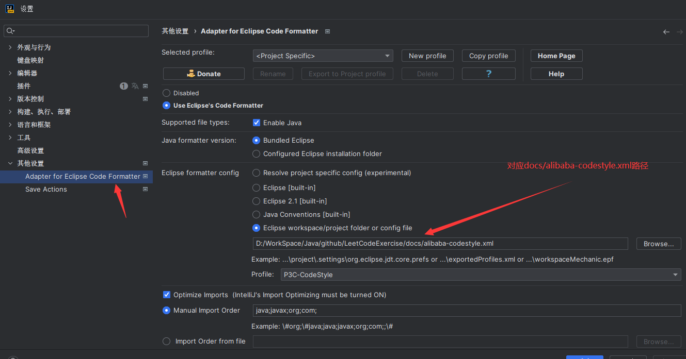
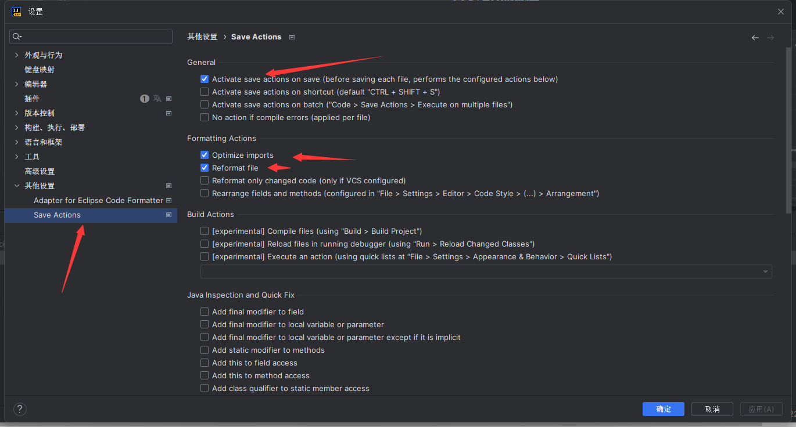

# 开发规范

# **!!!下载安装阿里巴巴开发规范插件!!!**

## 其它可选插件

1. Adapter for Eclipse C ode Formatter
   
2. Save Actions
   

两个插件安装配置完成后 编写完代码按下 ctrl + s 会自动按照阿里巴巴开发规范进行格式化代码

一、编程规范

1. 好代码的原则

   我们参考 Kent Beck 的简单设计四个原则来指导我们的如何写出优秀的代码，如何有效地判断我们的代码是优秀的。
    - 通过所有测试（Passes its tests）：强调的是外部需求，这是代码实现最重要的
    - 尽可能消除重复 (Minimizes duplication)：代码的模块架构设计，保证代码的正交性，保证代码更容易修改
    - 尽可能清晰表达 (Maximizes clarity)：代码的可阅读性，保证代码是容易阅读的
    - 更少代码元素 (Has fewer elements)：保证代码是简洁的，在简洁和表达力之间，我们更看重表达力

   以上四个原则的重要程度依次降低， 这组定义被称做简单设计原则。
2. 项目命名规范
   全部采用小写方式， 以中划线分隔。
   正例：mall-management-system / order-service-client / user-api
   反例：mall_management-system / mallManagementSystem / orderServiceClient
3. TODO/FIXME 规范
   TODO/TBD(to be determined) 注释一般用来描述已知待改进、待补充的修改点,并且加上作者名称。
   FIXME 注释一般用来描述已知缺陷，它们都应该有统一风格，方便文本搜索统一处理。如：
   ```
   // TODO <author-name>: 补充XX处理
   // FIXME <author-name>: XX缺陷
   ```
4. 方法参数规范
   无论是 controller，service，manager，dao 亦或是其他的代码，每个方法最多 3 个参数，如果超出 3 个参数的话，要封装成 javabean
   对象。
   方便他人调用，降低出错几率。尤其是当参数是同一种类型，仅仅依靠顺序区分，稍有不慎便是灾难性后果，而且排查起来也极其恶心。
   保持代码整洁、清晰度。当一个个方法里充斥着一堆堆参数的时候，再坚强的人，也会身心疲惫。
   反例：
    ```JAVA
    public class demo{
        /**
         * 使用证书加密数据工具方法 
         *
         * @param param
         * @param password 加密密码 
         * @param priCert 私钥 
         * @param pubCert 公钥 
         * @return 返回加密后的字符串
         */
        public String signEnvelop(JdRequestParam param, String password, String priCert, String pubCert){}
    
    }
    ```
5. 注释规范

- 注释和代码一样重要

注释是我们披荆斩棘历经磨难翻越需求这座大山时，留下的踪迹和收获的经验教训，这些宝贵的知识除了证明我们曾经存在过，也提醒着后来的人们殷鉴不远、继往开来。

注释除了说明作用、逻辑之外。

还有一个很重要的原因：当业务逻辑过于复杂，代码过于庞大的时候，注释就变成了一道道美化环境、分离与整理逻辑思路的路标。这是很重要的一点，它能有效得帮助我们免于陷入代码与业务逻辑的泥沼之中。
正例：

```java
public class demo {
    /**
     * 开始抽奖方法 
     * 保存中奖信息、奖励用户积分等 
     * @param luckDrawDTO 入参
     * @return ResponseDTO 返回中奖信息 
     */
    public ResponseDTO<String> startLuckDraw(LuckDrawDTO luckDrawDTO) {

        // -------------- 1、校验抽奖活动基本信息 ------------------------
        xxx伪代码一顿操作

                // -------------- 2、新增抽奖记录 -------------------------------
                xxx伪代码一顿操作;

        // -------------- 3、如果需要消耗积分，则扣除钢镚积分 -------------
        xxx伪代码一顿操作

                // -------------- 4、获取奖品信息，开始翻滚吧 --------------------
                xxx伪代码一顿操作;

        return ResponseDTO.succ(luckDrawPrizeVO);
    }
}

```

- 注释和代码的一致性

注释并不是越多越好，当注释过多，维护代码的同时，还需要维护注释，不仅变成了一种负担，也与我们当初添加注释的初衷背道而驰。

首先：大家应该通过清晰的逻辑架构，好的变量命名来提高代码可读性；需要的时候，才辅以注释说明。注释是为了帮助阅读者快速读懂代码，所以要从读者的角度出发，按需注释。注释内容要简洁、明了、无二义性，信息全面且不冗余。

其次：无论是修改、复制代码时，都要仔细核对注释内容是否正确。只改代码，不改注释是一种不文明行为，破坏了代码与注释的一致性，会让阅读者迷惑、费解，甚至误解。

反例：

```
// 查询部门
EmployeeDTO employee = employeeDao.listByDeptId(deptId);
```

- 方法注释

方法要尽量通过方法名自解释，不要写无用、信息冗余的方法头，不要写空有格式的方法头注释。

方法头注释内容可选，但不限于：功能说明、返回值，用法、算法实现等等。尤其是对外的方法接口声明，其注释，应当将重要、有用的信息表达清楚。

正例：

```java
public class demo {
    /**
     * 解析转换时间字符串为 LocalDate 时间类
     * 调用前必须校验字符串格式 否则可能造成解析失败的错误异常 
     * @param dateStr 必须是 yyyy-MM-dd 格式的字符串 
     * @return LocalDate
     */
    public static LocalDate parseYMD(String dateStr) {
    }
}


```

反例：

```java
public class demo {
    /**
     * 校验对象 
     * @param t
     * @return String
     */
    public static <T> String checkObj(T t);
}

```

反例中出现的问题：

方法注释没有说明具体的作用、使用事项。
参数、返回值，空有格式没内容。

这是非常重要一点，任何人调用任何方法之前都需要知道方法对参数的要求，以及返回值是什么。
